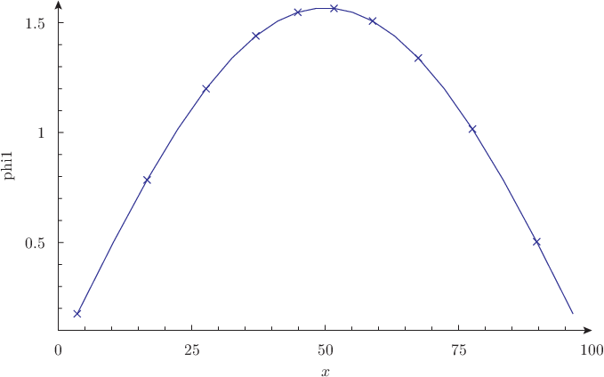
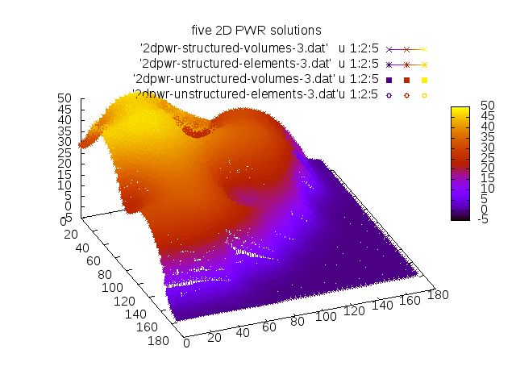
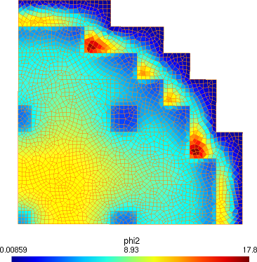
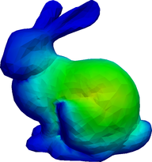
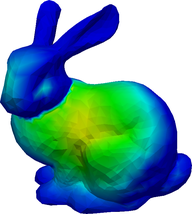
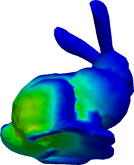
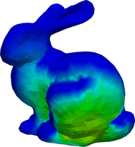
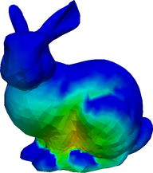

% milonga: a free nuclear reactor analysis code

{.img-responsive}\ 


[milonga](http://www.seamplex.com/milonga/) is a free core-level neutronic code that solves the steady-state multigroup neutron transport equation using either

 a. the diffusion approximation, or
 b. the discrete ordinates $S_N$ method
over unstructured grids (although simple structured grids can also be used) based on either

 i. a finite-volumes, or
 ii. a finite-elements
discretization scheme. It works on top of the [wasora](http://www.seamplex.com/wasora) framework, which provides means to parse and understand a high-level plain-text input file containing algebraic expressions, data for function interpolation, differential equations and output instructions amongst other facilities. Therefore, any mathematical computation which can be done by wasora---i.e. parametric calculations, multidimensional optimization, function interpolation and integration, etc.---can be combined with the facilities that milonga provides to solve the neutron diffusion equation.

Milonga’s main features are:

 * free & open source software (released under the terms of the [GNU GPL version 3](http://www.gnu.org/copyleft/gpl.html))
 * solves the steady-state few-group neutron transport equation over a [Gmsh](http://geuz.org/gmsh/)-generated unstructured grid in one, two or three spatial dimensions
 * may solve either the discrete ordinates or the diffusion formulation of the transport equation
 * may use either a finite-volumes or a finite-elements spatial discretization scheme to obtain a matrix-casted eigenvalue problem
 * solves any combination of multiplicative and non-multiplicative media with and without independent source
 * can solve for either the direct or the adjoint flux (TODO! only direct flux is computed right now)
 * structured grids may be generated for simple problems within milonga without needing an external mesher (discouraged)
 * macroscopic cross sections are given as algebraic expressions of $x$, $y$ and $z$ in a per-material basis
 * algebraic expressions may involve interpolated point-wised user-defined functions of one or more variable, so cross sections may depend on intermediate spatial distributions (e.g. temperatures)
 * algebraic expressions may involve standard functions ($\sin$, $\cos$, $\exp$, $\log$, etc.) and functionals (integrals, derivatives, roots, etc.)
 * computed results (i.e. $k_\text{eff}$, fluxes, power) are given as scalar variables and functions of $x$, $y$ and $z$ which may be further used in algebraic expressions
 * program output is 100% user-defined (in fact the program is silent if no explicit `PRINT`s are given)
 * milonga may be coupled to other calculation codes using files, shared-memory objects or python bindings
 * non-linear effects (e.g. xenon and/or thermalhydraulic feedback) may be solved in an iterative way
 * multidimensional quasi-random sequential parametric or non-linear minimization cases are easily created from single-run input files
 * milonga may be extended by runtime-loadable shared objects and/or fixed entry-point plugins
 * high-quality free & open third-party libraries are used to perform tasks that other people have already worked out: PETSc, SLEPc, GSL, IDA, Readline
 * new formulations and/or spatial discretizations schemes can be (more or less) easily added
 * milonga interfaces well with other UNIX tools (m4, grep, sed, awk, etc.) and plotting & post-processing tools (Gnuplot, Gmsh, LaTeX, ParaView, Pyxplot, etc.)

Actually, milonga can be seen as a glue layer between a mesh generator (i.e [Gmsh](http://geuz.org/gmsh/)) and a large sparse matrix solver (i.e [SLEPc](http://www.grycap.upv.es/slepc/) for eigenvalue problems and [PETSc](http://www.mcs.anl.gov/petsc/) for linear problems). That is to say, milonga builds the matrices $R$ and $F$ that cast the multigroup neutron transport/diffusion equation as a matrix-based eigenvalue problem:


$$F \phi = k_\text{eff} \cdot  R \phi $$

Should there be independent neutron sources $S$, then the problem is casted as a system of linear equations:

$$(F-R) \phi = S $$


These matrices are expected to be sparse, as they are the result of the discretization of the differential diffusion operator using either finite volumes or finite elements, over a certain spatial grid either generated by a mesher or structured defined within the milonga input file. Said matrices are thus built in [PETSc](http://www.mcs.anl.gov/petsc/) format, so they can either be passed to a parallel solver (default is [SLEPc](http://www.grycap.upv.es/slepc/), whose algorithms and parameters may be chosen at run-time) or even dumped into files to be opened later. The macroscopic cross-section may depend on the spatial coordinates $x$, $y$ and/or $z$ (depending on the dimension of the problem) not only because different materials may be assigned to the regions of the domain (i.e. physical entities) but also due to continuous dependence of these cross sections with arbitrary parameter distributions within the entity (i.e. temperatures, densities, poison concentration, etc.). These dependencies can be given either as point-wise interpolated functions or algebraic expressions (that may in turn involve point-wise defined data). 

Milonga provides also a second glue layer that links the output of the linear/eigen-solver to the input of a post-processing tool (i.e [Gmsh](http://geuz.org/gmsh/) or [ParaView](http://www.paraview.org/)). The effective multiplication factor $k_\text{eff}$ is stored as a wasora variable, and the fluxes and power distribution as point-wise defined multidimensional functions, which can then be added, subtracted, integrated, differentiated, etc. Parametric and optimization runs may be also performed.
 
{.img-responsive}\ 


# Quick start

> It is really worth any amount of time and effort to get away from Windows
if you are doing computational science.
>
> <https://lists.mcs.anl.gov/pipermail/petsc-users/2015-July/026388.html>

Open a terminal in a GNU/Linux box (may be a VirtualBox box) and make sure you install the following packages:

```
sudo apt-get install m4 make autoconf automake gcc git findutils libgsl-dev libsundials-serial-dev libreadline-dev libpetsc-dev libslepc-dev
```

If your distribution does not have [PETSc](http://www.mcs.anl.gov/petsc/) or [SLEPc](http://www.grycap.upv.es/slepc/), then you might need to compile them yourself. Ask for help in the mailing list at <https://www.seamplex.com/lists.html>.

Clone the milonga repository, bootstrap (might take a while as it has to clone and bootstrap [wasora](https://www.seamplex.com/wasora/) first), configure, compile and check:

```
git clone https://bitbucket.org/seamplex/milonga/
cd milonga
./autogen.sh
./configure
make
make check
```


# Examples & test suite

After the compilation of the code (that follows the standard `./configure && make` procedure, see `INSTALL` for details), one recommended step is to run the test suite with

```
$ make check
```

It consists of some cases that work both as examples of usage and as a suite of tests that check that milonga implements correctly the functionalities that are expected. Some cases have analytical solution and some not. Some cases used an already-generated unstructured mesh and some others need [Gmsh](http://geuz.org/gmsh/) to be installed. Some cases use [gnuplot](http://www.gnuplot.info/) to plot results. [ParaView](http://www.paraview.org/) can be used to post-process the last case. For some cases, milonga generates a markdown-formatted text file containing debugging and benchmarking information that can be converted to PDF and/or HTML with [pandoc](http://johnmacfarlane.net/pandoc/). In [Debian](http://www.debian.org)-based distributions, they can all be installed with:

```
# apt-get install gmsh gnuplot paraview pandoc
```


The `make check` command may not show the actual output of the examples but the overall result (i.e. whether the test passed, the test failed or the test was skipped). Expect your screen to be filled up with plots, post-processing views and browsers showing debugging and benchmarking information. Each individual test may be repeated by executing the `test-*.sh` scripts located in the `examples` subdirectory.

User iepale has shared a [set of input files](https://bitbucket.org/iepale/examples) that solve some of the [ANL-7416](http://www.corephysics.com/benchmarks/anl7416_benchmark15.pdf) benchmarks using his [fork of milonga](https://bitbucket.org/iepale/milo-tra) that allows to solve transient solutions. This fork will soon be merged into the [main milonga branch](https://bitbucket.org/seamplex/milonga).

## Slab

```wasora
# solves a one-dimensional slab either with a
# structured or unstrucutred mesh with a single file
#
# run as
# $ milonga slab.mil { structured | unstructured } [ --volumes | --elements ]
#

# we define two meshes
MESH NAME unstructured FILE_PATH slab.msh DIMENSIONS 1

a = 2 * 10.371065 # critical size of the problem UD20-1-0-SL (number 22 report Los Alamos)
MESH NAME structured   STRUCTURED         DIMENSIONS 1 NCELLS_X 20 LENGTH_X a

DEFAULT_ARGUMENT_VALUE 1 unstructured
MILONGA_PROBLEM MESH $1  # which mesh we use is selected from the commandline

MATERIAL fuel SigmaT 0.54628  SigmaS 0.464338  nuSigmaF 1.70*0.054628 D 1/(3*SigmaT(x))


PHYSICAL_ENTITY NAME left  BC null
PHYSICAL_ENTITY NAME right BC null

MILONGA_STEP
```

```
milonga slab.mil
```

{.img-responsive}


## Two-dimensional PWR IAEA benchmark

See `examples/2dpwr*.mil` for the actual input files.

```
gtheler@tom:~/wasora-suite/milonga/examples$ ./test-2dpwr.sh 
keff =  1.0293114574  ( structured volumes, lc =  3.33333 ,  5202 x 5202 ,  0.00 0.01 0.07  secs ) 
        max thermal flux  17.9 located at ( x = 135.00 , y = 55.00 ) 
keff =  1.0296896615  ( structured elements, lc =  3.33333 ,  5408 x 5408 ,  0.00 0.04 0.10  secs ) 
        max thermal flux  19.7 located at ( x = 56.67 , y = 136.67 ) 
keff =  1.0297517716  ( unstructured volumes, lc =  3.33333 ,  5994 x 5994 ,  0.00 0.01 0.19  secs ) 
        max thermal flux  17.8 located at ( x = 132.71 , y = 55.96 ) 
keff =  1.0296828170  ( unstructured elements, lc =  3.33333 ,  6204 x 6204 ,  0.00 0.05 0.24  secs ) 
        max thermal flux  19.7 located at ( x = 56.22 , y = 136.00 ) 
gtheler@tom:~/wasora-suite/milonga/examples$
```
    
{.img-responsive}


<div class="row">
 <div class="col-md-6">
{.img-responsive}
 </div>
 <div class="col-md-6">
{.img-responsive}
 </div>
</div>

## The Stanford Bunny

```wasora
# solves a three-dimensional shape with uniform XS
# the geometry should be given in $1.geo
# bulk material phyisical group should be named "fuel" and
# external surface phyisical group should be named "external"
# post-processing views are written as $1.vtk and $1.msh
#
# run as
#  $ milonga 3dshape.mil [ cube | cylinder | shpere | bunny ]
#                        [ --diffusion | --s2 | --s4 ]
#                        [ --volumes | --elements ]
#

# if the mesh does not already exists, call gmsh on the $1.geo file
SHELL "if [ ! -e $1.msh ]; then gmsh -v 0 -3 $1.geo; fi"
MESH FILE_PATH $1.msh DIMENSIONS 3

# these are the default values, they are overwritten by the commandline arguments
MILONGA_PROBLEM SCHEME elements FORMULATION s2

# some settings to improve cpu & memory usage
MILONGA_SOLVER EPS_TYPE jd ST_TYPE precond KSP_TYPE bcgs PC_TYPE asm

# table 12 in page 18 of Los Alamos Report LA-13511
# analytical benchmark test set for criticality code verification
MATERIAL U235a SigmaT 0.32640 SigmaS 0.248064 SigmaA 0.013056 nuSigmaF 2.7*0.065280

# link physical entities in the mesh to materials and boundary conditions
PHYSICAL_ENTITY NAME fuel     MATERIAL U235a
PHYSICAL_ENTITY NAME external BC vacuum

# do the magic!
MILONGA_STEP

# write some results into to the standard output
PRINT_FUNCTION phi1 HEADER
PRINT TEXT "\# keff     = " %.8f keff SEP " " TEXT "(" %+.1f 1e5*(1-1/keff) TEXT "pcm )"
PRINT TEXT "\# nodes    = " %.0f nodes
PRINT TEXT "\# elements = " %.0f elements
PRINT TEXT "\# CPU usage: "
PRINT TEXT "\#   init   = " %.3f time_cpu_ini   TEXT "seconds"
PRINT TEXT "\#   build  = " %.3f time_cpu_build TEXT "seconds"
PRINT TEXT "\#   solve  = " %.3f time_cpu_solve TEXT "seconds"
PRINT TEXT "\#   total  = " %.3f time_cpu_total TEXT "seconds"

# MILONGA_DEBUG MATRICES_X FILE_PATH 3dshape MATRICES_PETSC_OCTAVE

# files for gmsh and vtk post-processing
MESH_POST FILE_PATH $1_out.msh phi1
FLUX_POST FILE_PATH $1.vtk
```

```
$ milonga 3dshape.mil bunny
[...]
2.494790e+00    -9.692680e-01   7.595410e+00    2.275265e+00
-3.223120e+00   -2.619830e+00   5.786140e+00    1.707387e+00
# keff     =  0.92145559 ( -8523.9 pcm ) 
# nodes    =    3423
# elements =    18496
# CPU usage: 
#   init   =    0.001   seconds
#   build  =    1.608   seconds
#   solve  =    0.621   seconds
#   total  =    2.231   seconds
```

{.img-responsive}


<div class="row">
 <div class="col-md-3 col-xs-6">
{.img-responsive}
 </div>
 <div class="col-md-3 col-xs-6">
{.img-responsive}
 </div>
 <div class="col-md-3 col-xs-6">
{.img-responsive}
 </div>
 <div class="col-md-3 col-xs-6">
{.img-responsive}
 </div>
</div>
<div class="row">
 <div class="col-md-3 col-xs-6">
{.img-responsive}
 </div>
 <div class="col-md-3 col-xs-6">
{.img-responsive}
 </div>
 <div class="col-md-3 col-xs-6">
{.img-responsive}
 </div>
 <div class="col-md-3 col-xs-6">
{.img-responsive}
 </div>
</div>

The angular fluxes $\psi_g$ for $g=1,\dots,8$ from the S$_2$ formulation.

# Workshop

Check out <https://bitbucket.org/seamplex/2015-workshop> for a “hands-on” tutorial (text and input files) given a workshop held in 2015. The [presentation slides are here](https://www.seamplex.com/docs/2015-milonga-handson.pdf).

# Licensing

Milonga is distributed under the terms of the [GNU General Public License](http://www.gnu.org/copyleft/gpl.html) version 3 or (at your option) any later version.

Milonga is [free software](https://www.gnu.org/philosophy/free-sw.html)---both as in [free speech and as in free beer](https://en.wikipedia.org/wiki/Gratis_versus_libre), although the first meaning is far more important than the second one---and is distributed under the terms of the [GNU General Public License](http://www.gnu.org/copyleft/gpl.html) version\ 3 or (at your option) any later version. In words of the [Free Software Foundation](http://www.fsf.org/),

> Nobody should be restricted by the software they use. There are four freedoms that every user should have:
>
>  0. the freedom to use the software for any purpose,
>  1. the freedom to change the software to suit your needs,
>  2. the freedom to share the software with your friends and neighbors, and
>  3. the freedom to share the changes you make.
> When a program offers users all of these freedoms, we call it free software.
> 
> Developers who write software can release it under the terms of the GNU GPL. When they do, it will be free software and stay free software, no matter who changes or distributes the program. We call this [copyleft](https://en.wikipedia.org/wiki/Copyleft): the software is copyrighted, but instead of using those rights to restrict users like proprietary software does, we use them to ensure that every user has freedom.

Not only does milonga (and [wasora](https://www.seamplex.com/wasora)) provide all the four basic freedoms to the software user, but it also encourages her to study, understand, analyze and hack it. And of course, to share the associated discoveries, suggestions, improvements and fixed bugs under the terms of the GNU GPL---especially with wasora’s original author. To sum up:

> Milonga is free software: you can redistribute it and/or modify
> it under the terms of the GNU General Public License as published by
> the Free Software Foundation, either version~3 of the License, or
> (at your option) any later version.
> 
> Milonga is distributed in the hope that it will be useful,
> but WITHOUT ANY WARRANTY; without even the implied warranty of
> MERCHANTABILITY or FITNESS FOR A PARTICULAR PURPOSE.  See the
> GNU General Public License for more details.


# Further information


See the file `INSTALL` for compilation and installation instructions.  
See the directory `examples` for the test suite and other examples.  
See the contents of directory `doc` for full documentation.  

Home page: <http://www.seamplex.com/milonga>  
Repository: <http://bitbucket.org/seamplex/milonga>
Mailing list and bug reports: <wasora@seamplex.com>  


milonga is copyright ©2010--2017 jeremy theler  
milonga is licensed under [GNU GPL version 3](http://www.gnu.org/copyleft/gpl.html) or (at your option) any later version.  
milonga is  [free software](https://www.gnu.org/philosophy/free-sw.html): you are free to change and redistribute it.  
There is NO WARRANTY, to the extent permitted by law.  
See the file `COPYING` for copying conditions.  
